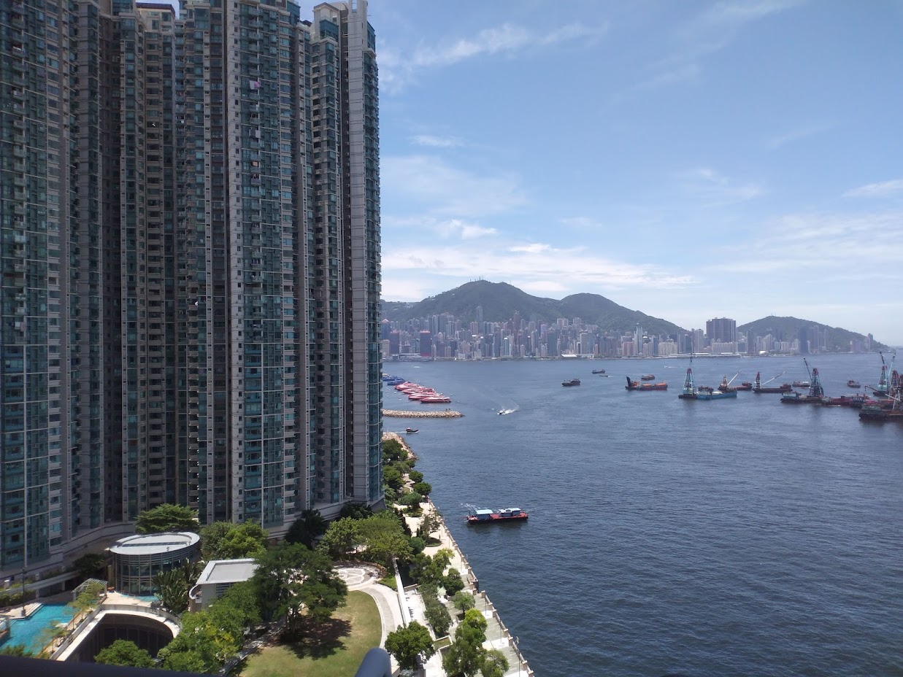
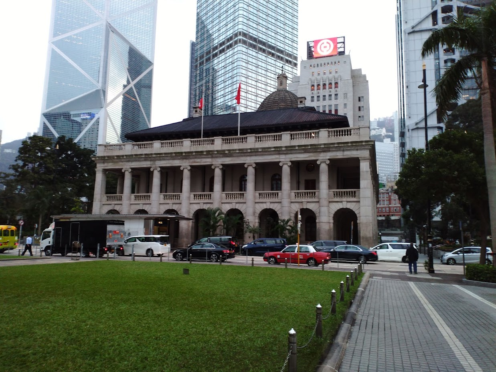

I was born and raised in Hong Kong, a special administrative region of the People's Republic of China. I was relatively surprised by how little people know about the history of and way of life in Hong Kong. Here are a list of things that I have tried explaining to others:

## my language

**Cantonese** is my mother tongue, which is also the primary language Hongkongers communicate in. It is different from Mandarin Chinese, which is what the rest of China uses for spoken communication. But I can also read and write Chinese characters (written communication), which for the most part is identical in Hong Kong and China. Hong Kong uses Traditional Chinese characters (just like Taiwan) but China uses Simplified Chinese characters.

**English** is my second language, and is in fact also another official language of the Hong Kong SAR government. Hong Kong was once a British colony (I will not further elaborate as that will entail a full lesson on [Hong Kong's history](https://en.wikipedia.org/wiki/History_of_Hong_Kong)), and English (along with Chinese and Putonghua) are the three required language subjects to study at school. Therefore, most residents in Hong Kong can speak, write, and understand English proficiently.

I can also understand and read Mandarin Chinese (**Putonghua**) simply due to the fact that I have learnt it through the school curriculum, but we generally struggle to speak fluent Putonghua since we mostly speak Cantonese in our daily lives. Putonghua and Cantonese are two completely separate languages and are also mutually unintelligible for the most part.

## my school

I attended kindergarten (4-6 years old), primary school (6-12 years old), and secondary school (12-15 years old) before moving to California. Notice they are not called pre-school, elementary, middle, or high school as they do in the US. As mentioned, Hong Kong once was a British colony, and our education systems naturally resemble the Brits'.

Hong Kong's education system, just like the rest of Asia's, are notorously challenging compared to the US, or so you thought. If you ask me which one I like or which is harder, you are basically like comparing apples and oranges. There are so much differences and nuances that I don't even know where to begin. I would only say that having experienced both has served me well as a student and a person, and definitely has led me to a wider worldview. 👀

## my life

Sometimes people are confused about the way of life that I used to have. They thought it would resemble the Chinese living in Mainland China. While we do have traditional Chinese customs and beliefs, Hong Kong people tends to lean a little closer to the Western ideals of individualism rather than China's socialism ideals. As a capitalist city, Hongkongers' day-today lives would be closer to a New Yorkers' than a resident in Beijing. Hong Kong Dollar (HKD), the city's official currency, is also surprisingly in the [top 10 most traded global currency](https://en.wikipedia.org/wiki/Template:Most_traded_currencies). Hong Kong has been a vibrant modern city and asking me where I prefer living is, again, like comparing between apples and oranges. Residing in any place has its pros and cons, and so far, there is nothing major that's intolerable about living in either Hong Kong or California, and I would like to keep it that way.

